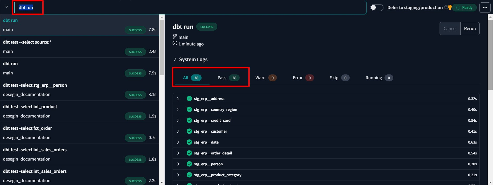
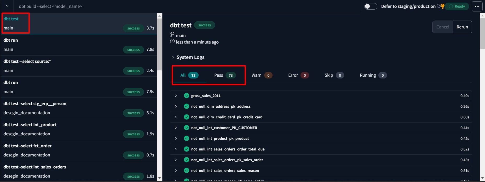
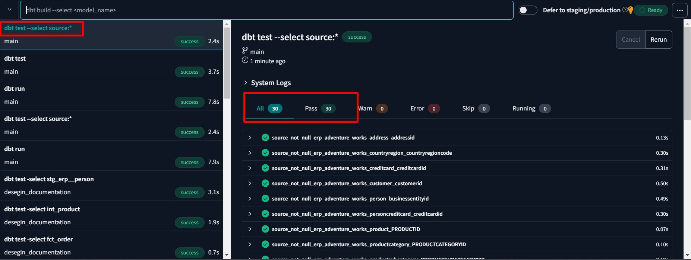

# 1. Testes dos pipelines de produção

Os testes dos pipelines de produção garagem que que todos os modelos e testes estão funcionando corretamente.

- **dbt run**:  
  O comando `dbt run` é utilizado para executar modelos SQL no data warehouse do Snowflake. Durante essa execução, dbt compila os modelos e materializa as tabelas ou visualizações conforme especificado. Esse processo transforma os dados brutos em modelos refinados e prontos para análise.

  

  Todos os teste foram executados com sucesso.

- **dbt test**:  
  O comando `dbt test` executa testes automatizados nos dados para garantir a integridade e qualidade. Esses testes verificam a presença de valores nulos, unicidade de registros, integridade referencial, entre outros. É uma etapa crucial para validar se os dados estão corretos e consistentes após as transformações.

    

  Todos os teste foram executados com sucesso.

- **dbt test source**:  
  O comando `dbt test source` valida as fontes de dados brutas antes da transformação. Ele permite verificar se as tabelas e colunas esperadas estão disponíveis e se contêm os dados necessários. Essa verificação ajuda a garantir que os pipelines de dados se baseiam em fontes confiáveis e atualizadas.

    

  Todos os teste foram executados com sucesso.

 # 2. Dashboard do BI

 O produto final do projeto é o dashboard onde será disponibilizado ao usuário final para visualizar os dados que respondem as perguntas necessárias para atender ao negócio.

## Versão para web

Clique no link abaixo para ser direcoinado ao Dashboard

<li><a href="https://app.powerbi.com/view?r=eyJrIjoiMzA4ZTgxZTctMjkxYy00NDc4LWJhNzMtYjQ1OTFjZDhkMzMzIiwidCI6IjE0Y2JkNWE3LWVjOTQtNDZiYS1iMzE0LWNjMGZjOTcyYTE2MSIsImMiOjh9"> Código Fonte</a></li>

