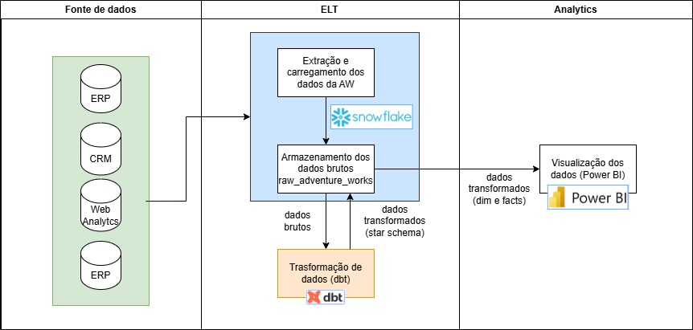
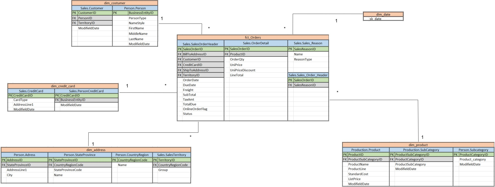

# 1. Ingestão de Dados

A etapa de ingestão de dados consiste em extrair, transformar e carregar (ETL) informações de diferentes sistemas e plataformas utilizadas pela Adventure Works. As fontes de dados incluem sistemas de gestão empresarial (ERP), gestão de relacionamento com o cliente (CRM), análises web e plataformas de gerenciamento de conteúdo:

## Arquitetura do DW:

## Tecnologias

- **Snowflake**:  
  Snowflake é uma plataforma de data warehouse baseada em nuvem que permite o armazenamento e processamento de grandes volumes de dados. Com uma arquitetura escalável e separação de armazenamento e computação, o Snowflake oferece flexibilidade, desempenho otimizado e suporte a múltiplos formatos de dados.

  Licença fornecida ao Engenheiro de Analytcs pela Indicium Academy.

- **dbt**:  
  dbt (Data Build Tool) é uma ferramenta de transformação de dados que permite analistas e engenheiros de dados a realizar modelagem, testes e documentação diretamente no data warehouse. Com dbt, é possível criar pipelines de dados reutilizáveis e automatizar o processo de transformação de dados.

    Licença fornecida ao Engenheiro de Analytcs pela Indicium Academy.

- **PowerBI**:  
  Power BI é uma plataforma de análise de negócios da Microsoft que fornece visualização interativa de dados e recursos de business intelligence. A ferramenta permite a conexão com diversas fontes de dados, facilitando a criação de relatórios, dashboards e insights avançados para a tomada de decisão.

    Licença fornecida ao Engenheiro de Analytcs pela Indicium Academy.

# 2. Fontes de Dados
As principais fontes de dados utilizadas no projeto são:

- **ERP (SAP)**: Sistema de gestão empresarial que fornece dados sobre vendas, estoque, compras e produção.
- **CRM (Salesforce)**: Plataforma de CRM que armazena informações sobre clientes, leads, oportunidades de vendas e interações.
- **Web Analytics (Google Analytics)**: Ferramenta de análise de tráfego e desempenho do site da empresa.
- **Site (WordPress)**: Plataforma de gerenciamento de conteúdo do site, onde são coletadas informações sobre interações dos usuários e formulários preenchidos.

## Novas Tabelas
Para suportar o processo analítico e estruturar melhor os dados no Data Warehouse, serão criadas novas tabelas dimensionais e tabelas fato. Abaixo está a descrição das principais tabelas.

### Tabela Dimensional: `dim_date`
A tabela `dim_date` fornece uma estrutura de tempo unificada que facilita a realização de análises temporais e agregações em relatórios. Essa dimensão oferece granularidade detalhada, permitindo consultas em diferentes níveis (mês, trimestre, ano, etc.).

**Colunas da Tabela `dim_date`**:

- **`MONTH_OF_YEAR`**: Número do mês dentro do ano (1 a 12).
- **`MONTH_NAME`**: Nome completo do mês (ex.: Janeiro, Fevereiro).
- **`MONTH_NAME_SHORT`**: Nome abreviado do mês (ex.: Jan, Fev).
- **`MONTH_START_DATE`**: Data de início do mês.
- **`MONTH_END_DATE`**: Data de término do mês.
- **`PRIOR_YEAR_MONTH_START_DATE`**: Data de início do mês correspondente do ano anterior.
- **`PRIOR_YEAR_MONTH_END_DATE`**: Data de término do mês correspondente do ano anterior.
- **`QUARTER_OF_YEAR`**: Número do trimestre dentro do ano (1 a 4).
- **`QUARTER_START_DATE`**: Data de início do trimestre.
- **`QUARTER_END_DATE`**: Data de término do trimestre.
- **`YEAR_NUMBER`**: Ano corrente (ex.: 2025, 2026).
- **`YEAR_START_DATE`**: Data de início do ano.
- **`YEAR_END_DATE`**: Data de término do ano.

### Tabela Fato Ordens: `fact_order`
A tabela `fact_order` armazena informações sobre os pedidos realizados. Esta tabela é central para as análises de vendas e desempenho operacional.

**Novas Colunas da Tabela `fact_order`**:

- **`status_online_description`**: Descrição textual do status do pedido em plataforma online (ex.: Pendente, Processado, Cancelado).

### Tabela Dimensional Customer: `dim_customer`
A tabela `dim_customer` armazena informações detalhadas sobre os clientes da empresa, permitindo análises personalizadas e segmentação.

**Novas Colunas da Tabela `dim_customer`**:

- **`formatted_name`**: Nome completo do cliente em formato padronizado.

# 3. Modelagem dos dados

## Modelo Conceitual

O modelo conceitual descreve as novas tabelas fatos e dimensão e as tabelas de dados brutos e colunas que as compôe, onde, foram projetadas utilizando o conceito de star schema para Data Warehouses:

